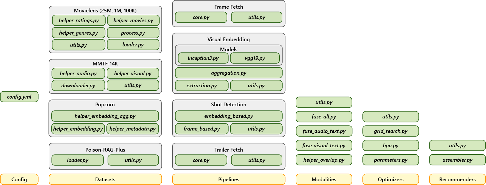

# 🍿 Popcorn


This is **Popcorn**; a multi-faceted resource that recommends movies with the power of **Computer Vision**, **Generative AI**, and **Recommender Systems**.
Whether you are a researcher, developer, or just a movie lover, **Popcorn** helps you explore smarter, more immersive ways to get movie recommendations. 🎥

## ✨ Why Popcorn?

- 🎬 **Movie-focused**: Built specifically for movie recommendation tasks.
- 👁️ **Visual-centric**: Supports integrating _visual_ features as well as _audio_ and _textual_ to capture the “look and feel” of films.
- 🧩 **Flexiblity and Reproducibility**: Includes a wide range of tools for dataset downloading, preprocessing, feature extraction, and benchmarking.

## 🛠️ Getting Started

### I. Installation from Source

1. Clone the repository using `git clone git@github.com:RecSys-lab/Popcorn.git`
2. Set up your environment (recommended: Python `3.10.4`). We highly suggest creating a Python virtual environment (using `python -m venv .venv`) and activating it (`source .venv/bin/activate` (Linux) or `.\.venv\Scripts\activate` (Windows)) before installing dependencies.
3. Install dependencies

```bash
cd popcorn
pip install -e .
```

### II. Installation via pip (Coming Soon)

The package is not yet fully available on `PyPI`. Once released, it will be installable via:

```bash
pip install popcorn-recsys
```

## 🚀 Quick Start

1. Modify the configurations based on what you target. In this case, you can modify the [config.yml](/popcorn/config/config.yml) file based on the [provided documentation](/popcorn/config/README.md).
2. Run the framework using `python main.py` and enjoy using the framework!

### 💡 Examples?

Not sure where to start? We have included a collection of ready-to-run examples in the [examples](/examples/) folder.

## 📊 Supported Datasets

As the framework supports multi-modal processing and covers **text**, **visual**, and **fused data**, varios datasets can be fed for reproducibility, evaluation, and experiments purposes:

- **Text Feed:** `MovieLenz-25M` ([link](https://grouplens.org/datasets/movielens/25m/)) is recommended to provide data about movies, user interactions, _etc._
- **Visual Feed:** `Popcorn Dataset` ([link](https://huggingface.co/datasets/alitourani/Popcorn_Dataset)) is collected by the team and provides frame-level features for each movie using different Convolutional Neural Networks (CNNs).

## 🗄️ Code Structure

You can find below where to search for the codes in the framework inside the `popcorn` folder:



## 📝 Citation

If you find **Popcorn** useful for your research or development, please cite the following [paper](#):

```
@article{tbd,
  title={TBD}
}
```

## 🤝 Contribution

Popcorn is made with ❤️ and popcorn for movie lovers everywhere! Contributions are always welcome! If you would like to add new features, fix bugs, or improve docs:

1. Fork this repository
2. Create a new branch (`git checkout -b branch-name`)
3. Apply your changes and commit them
4. Finally, open a _Pull Request_, and that's it! 🍿

The **Code Structure** section provides general information about where to add your new changes. Also, if you add new dependencies, do not forget to include them in `requirements.txt` using `pip freeze > requirements.txt` (you may need to remove the current file to have an updated version!).

## 📜 License

**Popcorn** is released under GPL-3 License. Read more about the license [here](/LICENSE).
