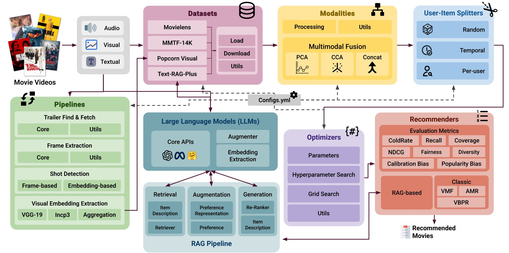
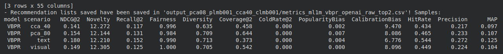
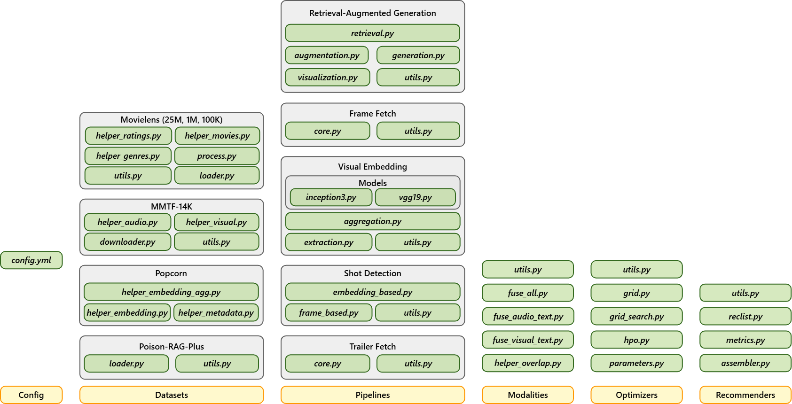

# 🍿 Popcorn



This is **Popcorn**; a multi-faceted, multimodal resource that recommends movies as a combination of **visual** (VLM-driven or CNN-based), **audio** (block-level audio features or i-vector), and **textual** (LLM-augmented or raw) content.
Whether you are a researcher, developer, or just a movie lover, **Popcorn** helps you explore smarter, more immersive ways to get movie recommendations. 🎥

## ✨ Why Popcorn?

- 🎬 **Movie-focused**: Built specifically for movie (and general video) recommendation tasks.
- 👁️ **Visual-centric**: Supports integrating _visual_ features as well as _audio_ and _textual_ to capture the “look and feel” of films.
- 🧩 **Flexiblity and Reproducibility**: Includes a wide range of tools for dataset downloading, preprocessing, feature extraction, and benchmarking.

## 🛠️ Getting Started

### I. Installation from Source

1. Clone the repository using `git clone git@github.com:RecSys-lab/Popcorn.git`
2. Set up your environment (recommended: Python `3.10.4`). We highly suggest creating a Python virtual environment (using `python -m venv .venv`) and activating it (`source .venv/bin/activate` (Linux) or `.\.venv\Scripts\activate` (Windows)) before installing dependencies.
3. Install dependencies

```bash
cd popcorn
pip install -e .
```

<!-- ### II. Installation via pip (Coming Soon)

The package is not yet fully available on `PyPI`. Once released, it will be installable via:

```bash
pip install popcorn-recsys
``` -->

## 🚀 Quick Start

1. Modify the configurations based on what you target. In this case, you can modify the [config.yml](/popcorn/config/config.yml) file based on the [provided documentation](/popcorn/config/README.md).
2. Run a quick framework test using `python examples/python/quick_test.py`, similar to the one below:

```python
from popcorn.utils import readConfigs
from popcorn.optimizers.grid_search import gridSearch
from popcorn.recommenders.reclist import generateLists
from popcorn.recommenders.assembler import assembleModality

# Step-0: Read the configuration file
configs = readConfigs("popcorn/config/config.yml")

# Step-1: Data ingestion and modality assembly
trainDF, testDF, trainSet, modalitiesDict, genreDict = assembleModality(configs)

# Step-2: Apply grid search to find the best model configurations
finalModels = gridSearch(configs, trainDF, trainSet, modalitiesDict)

# Step-3: Generate recommendation lists
generateLists(configs, trainDF, trainSet, testDF, genreDict, finalModels)
```

Running such a script will execute the whole pipeline of the framework, including data loading, modality assembly, model training, and recommendation list generation. Apart from the generated recommendation lists, you can also find a sample output below:



### 💡 Need More Examples?

We have included a collection of ready-to-run examples in the [examples](/examples/) folder. The examples cover various use cases of the framework, prepared in **local Python files** and **Google Colab** environments.

## 📊 Supported Datasets

As the framework supports multi-modal processing and covers **text**, **visual**, and **fused data**, varios datasets can be fed for reproducibility, evaluation, and experiments purposes:

- 🖹 **Textual Data:** `MovieLens` ([link](https://grouplens.org/datasets/movielens)) variants can be simply loaded in the framework to provide metadata about movies, user interactions, _etc._. Additionally, `RAG+` dataset ([link](https://github.com/yasdel/Poison-RAG-Plus/tree/main)) provides rich textual features extracted and augmented using Retrieval-Augmented Generation (RAG) techniques.

- 📸 **Visual Data:** `Popcorn-Visual` ([link](https://huggingface.co/datasets/alitourani/Popcorn_Dataset)) is collected by the team using this framework and includes visual features extracted from full-length movie videos, trailers, and shots using various visual content extractors. Additionally, `Thumbnails-VLM` ([link](https://huggingface.co/datasets/alitourani/movielens-25m-thumb)) is collected by `Popcorn` and contains over **300K** visual embeddings using six state-of-the-art Vision-Language Models (VLMs).
  Finally, `MMTF-14K` ([link](https://mmprj.github.io/mtrm_dataset/)) provides multi-modal features extracted from movie trailers and can be easily loaded by the framework.

- 🔊 **Audio Data:** `MMTF-14K` ([link](https://mmprj.github.io/mtrm_dataset/)) also provides audio features extracted from movie trailers and can be easily loaded by the framework.

## 🗄️ Code Structure

You can find below where to search for the codes in the framework inside the `popcorn` folder:



## 📚 Citation

```bibtex
@article{popcorn,
  title={Popcorn: A Configurable Benchmark for Visual Evidence in Multimodal Movie Recommendation},
  author={Tourani, Ali and Nazary, Fatemeh and Deldjoo, Yashar and Di Noia, Tommaso},
  journal={arXiv preprint arXiv:2606.09595},
  year={2026},
  doi={https://doi.org/10.48550/arXiv.2606.09595}
}
```

## 🤝 Contribution

Popcorn is made with ❤️ and popcorn for movie lovers everywhere! Contributions are always welcome! If you would like to add new features, fix bugs, or improve docs:

1. Fork this repository
2. Create a new branch (`git checkout -b branch-name`)
3. Apply your changes and commit them
4. Finally, open a _Pull Request_, and that's it! 🍿

The **Code Structure** section provides general information about where to add your new changes. Also, if you add new dependencies, do not forget to include them in `requirements.txt` using `pip freeze > requirements.txt` (you may need to remove the current file to have an updated version!).

## 📜 License

**Popcorn** is released under GPL-3 License. Read more about the license [here](/LICENSE).
